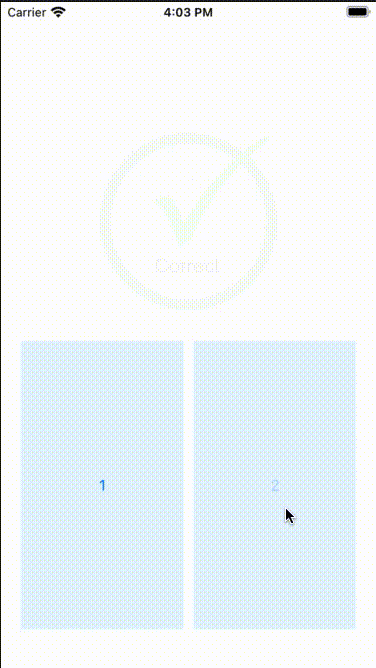
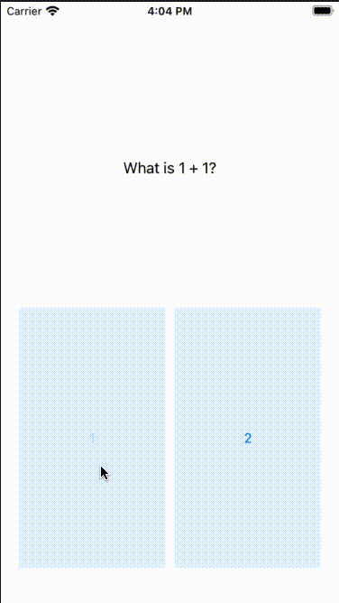

# ResponsePopUp
Example of how to do a answer popup to a question. This shows a correct or incorrect response.

This repo demonstrates a pop up response to a question within the view controller.

A demonstration is :

See https://richardlamu.medium.com/how-to-build-an-ios-pop-up-response-to-a-question-2a52a3ea30c9?sk=22784e6f663920a107e30e30590b27f1 
for more details.
